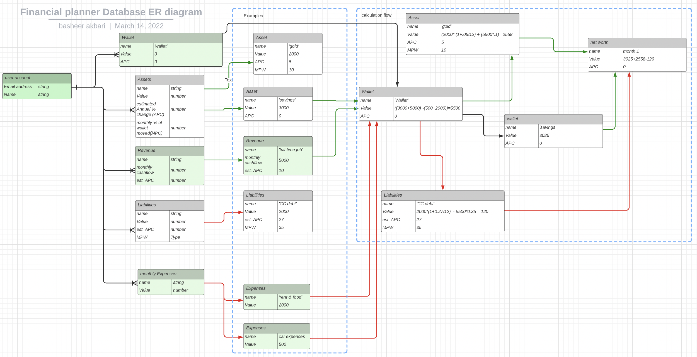

# Financial planner

## Description
this is a web based application which can take inputs such as monthly expenses and revenue and project the trajectory of your portfolio into the future. 

### wireframe of the website

### wireframe of the Portfolio page

### Database ERD

### Trello board

## Technologies Used
 JavaScript, HTML, CSS, MongoDB, Express, Node.js.

## Getting Started
This is the link to the deployed application

(https://finance-planner-app.herokuapp.com)

## instructions
create an account and then log in.
once logged in you can access the portfolio page and there will be a button which takes you to a form in which you can add an item to your portfolio.
The trajectory of the portfolio will be calculated and displayed as a chart on the portfolio page.

## Next Steps: Planned future enhancements (icebox items).

## Acknowledgments
